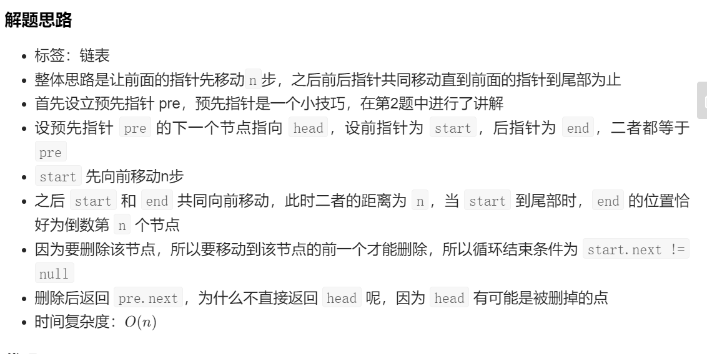

# 1. 两数之和

```java
给定一个整数数组 nums 和一个整数目标值 target，请你在该数组中找出 和为目标值的那两个整数，并返回它们的数组下标。
你可以假设每种输入只会对应一个答案。但是，数组中同一个元素不能使用两遍。
你可以按任意顺序返回答案。

示例 1：
输入：nums = [2,7,11,15], target = 9
输出：[0,1]
解释：因为 nums[0] + nums[1] == 9 ，返回 [0, 1] 。
示例 2：
输入：nums = [3,2,4], target = 6
输出：[1,2]
示例 3：
输入：nums = [3,3], target = 6
输出：[0,1]

class Solution {
   public int[] twoSum(int[] nums, int target) {
        Map<Integer,Integer> map =new HashMap<>();
        for(int i=0;i<nums.length;i++){
            if(map.containsKey(target-nums[i])){
                return new int[]{map.get(target-nums[i]),i};//注意返回值，返回target-nums[i]
            }
            map.put(nums[i],i);
        }
        throw new IllegalArgumentException("No two sum solution");
    }
}
```

设置一个哈希表，将num中的值作为哈希表的键，num索引当作哈希表的值，遍历num，若在哈希表中存在target-num[i],就以target-num[i]作为键取出值与当前索引i一起返回，如果不存在，就将target-num[i]作为键，i作为值存入哈希表。

# 2.两数相加


给你两个 非空 的链表，表示两个非负的整数。它们每位数字都是按照 逆序 的方式存储的，并且每个节点只能存储 一位 数字。

请你将两个数相加，并以相同形式返回一个表示和的链表。

你可以假设除了数字 0 之外，这两个数都不会以 0 开头。


```
示例1
输入：l1 = [2,4,3], l2 = [5,6,4]
输出：[7,0,8]
解释：342 + 465 = 807.
示例2
输入：l1 = [0], l2 = [0]
输出：[0]
示例3
输入：l1 = [9,9,9,9,9,9,9], l2 = [9,9,9,9]
输出：[8,9,9,9,0,0,0,1]
```

**提示：**

- 每个链表中的节点数在范围 `[1, 100]` 内

- `0 <= Node.val <= 9`

- 题目数据保证列表表示的数字不含前导零

  解法1

  ```java
  import java.util.Stack;
  
  class ListNode {
      int val;
      ListNode next;
      ListNode() {}
      ListNode(int val) { this.val = val; }
      ListNode(int val, ListNode next) { this.val = val; this.next = next; }
  }
  class Solution {
      public ListNode addTwoNumbers(ListNode l1, ListNode l2) {
          int carry=0;
          int tmp;
          ListNode res=new ListNode();
          ListNode p=res;
          ListNode pre=null;
          while((l1!=null)&&(l2!=null)){
              tmp=l1.val+l2.val+carry;
              p.val=tmp%10;
              p.next=new ListNode();
              pre=p;
              p=p.next;
              carry=tmp/10;
              l1=l1.next;
              l2=l2.next;
          }
          while (l1!=null){
              tmp=(l1.val+carry);
              carry=tmp/10;
              p.val=tmp%10;
              p.next=new ListNode();
              pre=p;
              p=p.next;
              l1=l1.next;
          }
  
          while (l2!=null){//注意carry不等于0
              tmp=(l2.val+carry);
              carry=tmp/10;
              p.val=tmp%10;
              p.next=new ListNode();
              pre=p;
              p=p.next;
              l2=l2.next;
          }
          if(carry!=0){
              p.val=carry;
              pre=p;
              p.next=new ListNode();
              p=p.next;
          }
          pre.next=null;
          return res;
      }
  
      public ListNode create(int[] args){
          ListNode l=new ListNode();
          ListNode p=l;
          ListNode pre=null;
          for(int i=0;i<args.length;i++){
              p.val=args[i];
              pre=p;
              p.next=new ListNode();
              p=p.next;
          }
          pre.next=null;
          return l;
      }
  
  }
  
  public class shua {
  
  
  
      public static void main(String[] args){
  
          Solution s=new Solution();
          ListNode l1=s.create(new int[]{9,9,9,9,9,9,9});
          ListNode l2=s.create(new int[]{9,9,9,9});
          ListNode res=s.addTwoNumbers(l1,l2);
          while (res!=null){
              System.out.print(res.val);
              res=res.next;
          }
  
      }
  }
  ```

解法2

```java
class Solution {
    public ListNode addTwoNumbers(ListNode l1, ListNode l2) {
        ListNode pre = new ListNode(0);
        ListNode cur = pre;
        int carry = 0;
        while(l1 != null || l2 != null) {
            int x = l1 == null ? 0 : l1.val;
            int y = l2 == null ? 0 : l2.val;
            int sum = x + y + carry;
            
            carry = sum / 10;
            sum = sum % 10;
            cur.next = new ListNode(sum);

            cur = cur.next;
            if(l1 != null)
                l1 = l1.next;
            if(l2 != null)
                l2 = l2.next;
        }
        if(carry == 1) {
            cur.next = new ListNode(carry);
        }
        return pre.next;
    }
}


```

# 3. 滑动窗口：无重复最长字串的长度

题目描述

```
给定一个字符串，请你找出其中不含有重复字符的 最长子串 的长度。

示例 1:
输入: s = "abcabcbb"
输出: 3
解释: 因为无重复字符的最长子串是 "abc"，所以其长度为 3。

示例 2:
输入: s = "bbbbb"
输出: 1
解释: 因为无重复字符的最长子串是 "b"，所以其长度为 1。

示例 3:
输入: s = "pwwkew"
输出: 3
解释: 因为无重复字符的最长子串是 "wke"，所以其长度为 3。

     请注意，你的答案必须是 子串 的长度，"pwke" 是一个子序列，不是子串。
示例 4:
输入: s = ""
输出: 0

提示：
0 <= s.length <= 5 * 104
s 由英文字母、数字、符号和空格组成

```


同时要注意区分**子串**与**子序列**

解答

```java
class Solution {
    public int lengthOfLongestSubstring(String s) {
        if(s.length()==0){return 0;}
        HashMap<Character,Integer> map=new HashMap<>();
        int left=0;
        int max=0;
        for(int i=0;i<s.length();i++){
            if(map.containsKey(s.charAt(i))){
                left=Math.max(left,map.get(s.charAt(i))+1);
            }
            map.put(s.charAt(i),i);
            max=Math.max(max,i-left+1);
        }
        return max;
    }
}
```

# 4.整数反转

```java
给你一个 32 位的有符号整数 x ，返回 x 中每位上的数字反转后的结果。

如果反转后整数超过 32 位的有符号整数的范围 [−231,  231 − 1] ，就返回 0。

假设环境不允许存储 64 位整数（有符号或无符号）。
 

示例 1：

输入：x = 123
输出：321
示例 2：

输入：x = -123
输出：-321
示例 3：

输入：x = 120
输出：21
示例 4：

输入：x = 0
输出：0
 

提示：

-231 <= x <= 231 - 1
。
```


````java
class Solution {
     public int reverse(int x) {
        int res=0;
        int tmp=0;
        while (x!=0){
            tmp=x%10;
            x/=10;
            if(res>Integer.MAX_VALUE/10||(res==Integer.MAX_VALUE/10&&tmp>7)){
                return 0;
            }
            if(res<Integer.MIN_VALUE/10||(res==Integer.MIN_VALUE/10&&tmp<-8)){
                return 0;
            }
            res=res*10+tmp;//此条件不可以挪到两个if之前，因为有可能溢出
        }
        return res;
    }
}
````

# 5.回文数

下面做法不高效

```java
class Solution {
    public boolean isPalindrome(int x) {
        if(x<0){return false;}
        Deque<Integer> deque=new ArrayDeque<>();
        while (x!=0){
            deque.add(x%10);
            x/=10;
        }
        int len=deque.size()/2;
        for(int i=0;i<len;i++){
            System.out.println("a");
            if(deque.pollFirst()!=deque.pollLast()){

                return false;
            }
        }
        return true;
    }
}
```

## 6.反转链表

```
反转一个单链表。
示例:
输入: 1->2->3->4->5->NULL
输出: 5->4->3->2->1->NULL
class Solution {
    ListNode res=null;
    ListNode p=null;
    public void compute(ListNode head){
        if(head==null||head.next==null){
            res=head;
            p=res;
            return;
        }
        compute(head.next);
        if(res==null){return;}
        p.next=head;
        p=p.next;
    }
    public ListNode reverseList(ListNode head) {
        compute(head);
        if(res!=null){
            p.next=null;
        }
        return res;
    }
}
```

# 6. 寻找两个正序数组中位数

```
给定两个大小分别为 m 和 n 的正序（从小到大）数组 nums1 和 nums2。请你找出并返回这两个正序数组的 中位数 。
示例 1：
输入：nums1 = [1,3], nums2 = [2]
输出：2.00000
解释：合并数组 = [1,2,3] ，中位数 2
示例 2：
输入：nums1 = [1,2], nums2 = [3,4]
输出：2.50000
解释：合并数组 = [1,2,3,4] ，中位数 (2 + 3) / 2 = 2.5
示例 3：
输入：nums1 = [0,0], nums2 = [0,0]
输出：0.00000
示例 4：
输入：nums1 = [], nums2 = [1]
输出：1.00000
示例 5：
输入：nums1 = [2], nums2 = []
输出：2.00000
提示：
nums1.length == m
nums2.length == n
0 <= m <= 1000
0 <= n <= 1000
1 <= m + n <= 2000
-106 <= nums1[i], nums2[i] <= 106
```


```java
class Solution {
    public double findMedianSortedArrays(int[] A, int[] B) {
        int m=A.length;
        int n=B.length;
        int len=m+n;
        int aStart=0;
        int bStart=0;
        int left=-1;int right=-1;
        for(int i=0;i<=len/2;i++){
            left=right;
            if(aStart<m&&(bStart>=n||A[aStart]<B[bStart])){
                right=A[aStart++];
            }else {
                right=B[bStart++];
            }
        }
        if((len&1)==0){
            return (left+right)/2.0;//注意此处为2.0否则为偶数的时候中位数只能是整数
        }else
            return right;
    }
}
```

# 7.寻找最长回文子串

```
给你一个字符串 s，找到 s 中最长的回文子串。
示例 1：
输入：s = "babad"
输出："bab"
解释："aba" 同样是符合题意的答案。
示例 2：
输入：s = "cbbd"
输出："bb"
示例 3：
输入：s = "a"
输出："a"
示例 4：
输入：s = "ac"
输出："a"
提示：
1 <= s.length <= 1000
s 仅由数字和英文字母（大写和/或小写）组成
```


```java
暴力解法
class Solution {
    public boolean isRes(int start,int end,String s){
        while (start<=end){
            if(s.charAt(start)!=s.charAt(end)) return false;
            start++;
            end--;
        }
        return true;
    }
    public String longestPalindrome(String s) {
        int max=0;
        int start=0,end=0;
        for(int i=0;i<s.length();i++){
            for(int j=i+max;j<s.length();j++){
                if(s.substring(i,j+1).length()>max&&isRes(i,j,s)){
                    if(max<(j-i+1)) {
                        max = j - i + 1;
                        start = i;
                        end = j;
                    }
                }
            }
        }
        return s.substring(start,end+1);
    }
}
```

```java
中心扩散
class Solution {
    public String longestPalindrome(String s) {
        int left,right;
        int max=1;
        int start=0;
        int len=1;
        for(int i=0;i<s.length();i++){
            left=i-1;right=i+1;
            while (left>=0&&s.charAt(left)==s.charAt(i)){
                len++;
                left--;
            }
            while (right<s.length()&&s.charAt(right)==s.charAt(i)){
                len++;
                right++;
            }
            while (left>=0&&right<s.length()&&s.charAt(left)==s.charAt(right)){
                len+=2;//注意是+2
                right++;
                left--;
            }
            if(len>max){
                max=len;
                start=left+1;
            }
            len=1;//注意置1
        }

        return s.substring(start,start+max);

    }
}
```

# 8. Z字形变换

```
将一个给定字符串 s 根据给定的行数 numRows ，以从上往下、从左到右进行 Z 字形排列。
比如输入字符串为 "PAYPALISHIRING" 行数为 3 时，排列如下：
P   A   H   N
A P L S I I G
Y   I   R
之后，你的输出需要从左往右逐行读取，产生出一个新的字符串，比如："PAHNAPLSIIGYIR"。
请你实现这个将字符串进行指定行数变换的函数：
string convert(string s, int numRows);

示例 1：
输入：s = "PAYPALISHIRING", numRows = 3
输出："PAHNAPLSIIGYIR"
示例 2：
输入：s = "PAYPALISHIRING", numRows = 4
输出："PINALSIGYAHRPI"
解释：
P     I    N
A   L S  I G
Y A   H R
P     I
示例 3：
输入：s = "A", numRows = 1
输出："A"
提示：
1 <= s.length <= 1000
s 由英文字母（小写和大写）、',' 和 '.' 组成
1 <= numRows <= 1000
```


```java
class Solution {
    public String convert(String s, int numRows) {
        if(numRows<2) return s;
        List<StringBuilder> rows=new ArrayList<>();
        for(int i=0;i<numRows;i++)rows.add(new StringBuilder());
        int flag=-1; int i=0;
        for(Character c:s.toCharArray()){
            rows.get(i).append(c);
            if(i==0||i==numRows-1) flag=-flag;
            i+=flag;
        }
        StringBuilder res=new StringBuilder();
        for(StringBuilder row:rows) res.append(row);
        return res.toString();


    }
}
```

# 9. 盛最多水的容器(双指针)

```
给你 n 个非负整数 a1，a2，...，an，每个数代表坐标中的一个点 (i, ai) 。在坐标内画 n 条垂直线，垂直线 i 的两个端点分别为 (i, ai) 和 (i, 0) 。找出其中的两条线，使得它们与 x 轴共同构成的容器可以容纳最多的水。

说明：你不能倾斜容器。

 

示例 1：


输入：[1,8,6,2,5,4,8,3,7]
输出：49 
解释：图中垂直线代表输入数组 [1,8,6,2,5,4,8,3,7]。在此情况下，容器能够容纳水（表示为蓝色部分）的最大值为 49。
示例 2：

输入：height = [1,1]
输出：1
示例 3：

输入：height = [4,3,2,1,4]
输出：16
示例 4：

输入：height = [1,2,1]
输出：2
 

提示：

n = height.length
2 <= n <= 3 * 104
0 <= height[i] <= 3 * 104

```


```java
class Solution {
    public int maxArea(int[] height) {
        int left=0;
        int max=0;
        int right=height.length-1;
        while (left<right){
            max=max>(Math.min(height[left],height[right])*(right-left))?max:Math.min(height[left],height[right])*(right-left);
            if(height[left]<height[right]){
                left++;
            }else {
                right--;
            }
        }
        return max;
    }
}
```

# 10.整数转罗马数字（贪心）

```
罗马数字包含以下七种字符： I， V， X， L，C，D 和 M。

字符          数值
I             1
V             5
X             10
L             50
C             100
D             500
M             1000
例如， 罗马数字 2 写做 II ，即为两个并列的 1。12 写做 XII ，即为 X + II 。 27 写做  XXVII, 即为 XX + V + II 。

通常情况下，罗马数字中小的数字在大的数字的右边。但也存在特例，例如 4 不写做 IIII，而是 IV。数字 1 在数字 5 的左边，所表示的数等于大数 5 减小数 1 得到的数值 4 。同样地，数字 9 表示为 IX。这个特殊的规则只适用于以下六种情况：

I 可以放在 V (5) 和 X (10) 的左边，来表示 4 和 9。
X 可以放在 L (50) 和 C (100) 的左边，来表示 40 和 90。 
C 可以放在 D (500) 和 M (1000) 的左边，来表示 400 和 900。
给定一个整数，将其转为罗马数字。输入确保在 1 到 3999 的范围内。

 

示例 1:

输入: 3
输出: "III"
示例 2:

输入: 4
输出: "IV"
示例 3:

输入: 9
输出: "IX"
示例 4:

输入: 58
输出: "LVIII"
解释: L = 50, V = 5, III = 3.
示例 5:

输入: 1994
输出: "MCMXCIV"
解释: M = 1000, CM = 900, XC = 90, IV = 4.
 

提示：

1 <= num <= 3999
```

```java
class Solution {
    public String intToRoman(int num) {
        int[] values=new int[]{1000,900,500,400,100,90,50,40,10,9,5,4,1};
        String[] symbol=new String[]{"M","CM","D","CD","C","XC","L","XL","X","IX","V","IV","I"};
        StringBuilder sb=new StringBuilder();
        for(int i=0;i<values.length;i++){
            while (i<values.length&&num>values[i]){
                sb.append(symbol[i]);
                num-=values[i];
            }
        }
        return sb.toString();
    }
}
```

# 11. 罗马数字转整数(哈希表)

```
罗马数字包含以下七种字符: I， V， X， L，C，D 和 M。

字符          数值
I             1
V             5
X             10
L             50
C             100
D             500
M             1000
例如， 罗马数字 2 写做 II ，即为两个并列的 1。12 写做 XII ，即为 X + II 。 27 写做  XXVII, 即为 XX + V + II 。

通常情况下，罗马数字中小的数字在大的数字的右边。但也存在特例，例如 4 不写做 IIII，而是 IV。数字 1 在数字 5 的左边，所表示的数等于大数 5 减小数 1 得到的数值 4 。同样地，数字 9 表示为 IX。这个特殊的规则只适用于以下六种情况：

I 可以放在 V (5) 和 X (10) 的左边，来表示 4 和 9。
X 可以放在 L (50) 和 C (100) 的左边，来表示 40 和 90。 
C 可以放在 D (500) 和 M (1000) 的左边，来表示 400 和 900。
给定一个罗马数字，将其转换成整数。输入确保在 1 到 3999 的范围内。

示例 1:

输入: "III"
输出: 3
示例 2:

输入: "IV"
输出: 4
示例 3:

输入: "IX"
输出: 9
示例 4:

输入: "LVIII"
输出: 58
解释: L = 50, V= 5, III = 3.
示例 5:

输入: "MCMXCIV"
输出: 1994
解释: M = 1000, CM = 900, XC = 90, IV = 4.
 

提示：

1 <= s.length <= 15
s 仅含字符 ('I', 'V', 'X', 'L', 'C', 'D', 'M')
题目数据保证 s 是一个有效的罗马数字，且表示整数在范围 [1, 3999] 内
题目所给测试用例皆符合罗马数字书写规则，不会出现跨位等情况。
IL 和 IM 这样的例子并不符合题目要求，49 应该写作 XLIX，999 应该写作 CMXCIX 。
关于罗马数字的详尽书写规则，可以参考 罗马数字 - Mathematics 。
```

```java
class Solution {
    public int romanToInt(String s) {
        HashMap<String,Integer> map=new HashMap<>();
        map.put("I", 1);
        map.put("IV", 4);
        map.put("V", 5);
        map.put("IX", 9);
        map.put("X", 10);
        map.put("XL", 40);
        map.put("L", 50);
        map.put("XC", 90);
        map.put("C", 100);
        map.put("CD", 400);
        map.put("D", 500);
        map.put("CM", 900);
        map.put("M", 1000);
        int ans=0;
        for(int i=0;i<s.length();i++){
            if(i+1<s.length()&&map.containsKey(s.substring(i,i+2))){
                ans=map.get(s.substring(i,i+2))+ans;
                i++;
            }else {
                ans=ans+map.get(s.substring(i,i+1));
            }

        }
        return ans;
    }
}
```

# 12. 最长公共前缀

```
编写一个函数来查找字符串数组中的最长公共前缀。

如果不存在公共前缀，返回空字符串 ""。

 

示例 1：

输入：strs = ["flower","flow","flight"]
输出："fl"
示例 2：

输入：strs = ["dog","racecar","car"]
输出：""
解释：输入不存在公共前缀。
 

提示：

0 <= strs.length <= 200
0 <= strs[i].length <= 200
strs[i] 仅由小写英文字母组成
```

```java
class Solution {
    public String longestCommonPrefix(String[] strs) {
        if(strs.length==0)return "";
        StringBuilder sb=new StringBuilder();
        sb.append("");
        String diff=strs[0];
        boolean ok;
        for(int j=0;j<diff.length();j++){
            ok=true;
           for(int i=0;i<strs.length;i++){
               if(strs[i].length()-1<j) return sb.toString();
               if(strs[i].charAt(j)!=diff.charAt(j))
               {
                   ok=false;
               }
           }
           if(ok){
               sb.append(diff.charAt(j));
           }else
           {
               return sb.toString();
           }

        }
        return sb.toString();
    }
}
```

第二种写法

```java
class Solution {
    public String longestCommonPrefix(String[] strs) {
        if(strs==null||strs.length==0){return "";}
        for(int i=0;i<strs[0].length();i++){
            char c=strs[0].charAt(i);
            for(int j=1;j<strs.length;j++){
                if(i==strs[j].length()||strs[j].charAt(i)!=c){
                    return strs[0].substring(0,i);
                }
            }
        }
        return strs[0];
    }
}
```


```

 #include <stdio.h>

  
 int n = 0;

  
 void swap(int *a, int*b) {

  
 int
  m; 

  m = *a; 

  *a = *b; 

  *b = m;

  } 

 void perm(int list[], int k, int m) {

  
 int i; 
if (k > m) { 

 for
 (i = 
 0
 ; i <= m; i++) 

  printf(
 "%d "
 , list[i]); 
  

  printf(
 "\n"
 ); 
  

  n++; 

  } 

 else
  { 

  for
 (i = k; i <= m; i++) { 

  swap(&list[k], &list[i]); 
  perm(list, k + 1, m); 
  swap(&list[k], &list[i]); 
  } 

  } 

 } 

 int
  main() { 

 int
  list[] = {
 1
 , 
 2
 , 
 3
 , 
 4
 , 
 5
 }; 

 perm(list, 0, 4); 

 printf(
 "total:%d\n"
 , n); 
 return
  
 0
 ; 

 } 

————————————————
版权声明：本文为CSDN博主「DreamNotOver」的原创文章，遵循CC 4.0 BY-SA版权协议，转载请附上原文出处链接及本声明。
原文链接：https://blog.csdn.net/lwhsyit/article/details/80598827
```

# 13.三数之和（双指针）

```
给你一个包含 n 个整数的数组 nums，判断 nums 中是否存在三个元素 a，b，c ，使得 a + b + c = 0 ？请你找出所有和为 0 且不重复的三元组。

注意：答案中不可以包含重复的三元组。

 

示例 1：

输入：nums = [-1,0,1,2,-1,-4]
输出：[[-1,-1,2],[-1,0,1]]
示例 2：

输入：nums = []
输出：[]
示例 3：

输入：nums = [0]
输出：[]
 

提示：

0 <= nums.length <= 3000
-105 <= nums[i] <= 105

```

```java
递归超时
class Solution {

    List<List<Integer>> res=new ArrayList<>();
    List<Integer> rowS=new ArrayList<>();
    int[] nums;

    public void compute(int deep,int index,int sum){
        if(deep>3){
            if(sum==0)
            {
                List<Integer>item=new ArrayList<>();
                for(Integer c:rowS){
                    item.add(c);
                }
                res.add(item);
            }
            return;
        }
        for(int i=index;i<nums.length;i++){
            rowS.add(nums[i]);
            compute(deep+1,i+1,sum+nums[i]);
            rowS.remove(rowS.size()-1);
            while (i+1<nums.length&&nums[i]==nums[i+1]) i++;
        }
    }
    public List<List<Integer>> threeSum(int[] nums) {
        if(nums.length<3) return new ArrayList<>() ;
        Arrays.sort(nums);
        if((nums[nums.length-1]>0&&nums[0]>0)||(nums[nums.length-1]<0&&nums[0]<0)) return new ArrayList<>() ;
        this.nums=nums;
        compute(1,0,0);
        return res;
    }
}
```

```java
class Solution {
    public List<List<Integer>> threeSum(int[] nums) {
        List<List<Integer>> ans = new ArrayList<>();
        if(nums==null||nums.length<3)return ans;
        int sum;
        int left,right;
        Arrays.sort(nums);
        for(int i=0;i<nums.length;i++){
            if(i>0&&nums[i]==nums[i-1])continue;///1
            left=i+1;
            right=nums.length-1;
            while (left<right){

                sum=nums[left]+nums[right]+nums[i];
                if(sum>0){
                    right--;
                }else if(sum<0){
                    left++;
                }else if(sum==0){
                    ans.add(Arrays.asList(nums[i],nums[left],nums[right]));
                    while (left<right&&nums[left+1]==nums[left]) {left++;}//只有当0的时候才有可能产生重复解。
                    while (left<right&&nums[right-1]==nums[right]) {right--;}
                    left++;////2
                    right--;////3
                }
            }
        }
        return ans;
    }
}
```

* 上面的1处很巧妙，因为只有三个值，要去除重复解，例如aabcd，当i在第一个a处的时候与后一个a重复，但是第一个a要用一次，因为有可能aacd为0，所以a必须用一次而nums[i]==nums[i-1]且i>0表示的是当在第二a的时候的判断，所以如果是aaabcd的时候第三个a会跳过，是i跳过
* 注意2，3两处，因为为0的时候这个时候不但要判断是否与后面有重复的值，而且两个指针都要进行移动。
* 什么样的问题适合用双指针技巧？**当问题是从一个有序的数组或链表中，找到一个元素的子集，该子集需要满足某种限制。**

# 14. 最接近的三数之和(双指针)

```
给定一个包括 n 个整数的数组 nums 和 一个目标值 target。找出 nums 中的三个整数，使得它们的和与 target 最接近。返回这三个数的和。假定每组输入只存在唯一答案。
示例：
输入：nums = [-1,2,1,-4], target = 1
输出：2
解释：与 target 最接近的和是 2 (-1 + 2 + 1 = 2) 。


提示：
3 <= nums.length <= 10^3
-10^3 <= nums[i] <= 10^3
-10^4 <= target <= 10^4

```

```java
class Solution {
    public int threeSumClosest(int[] nums, int target) {
        int anst,ans;
        ans=0;
        int diff=Integer.MAX_VALUE;
        int left,right;
        int temp;
        Arrays.sort(nums);
        for(int i=0;i<nums.length;i++){
            if(i>0&&nums[i]==nums[i-1])continue;
            left=i+1;
            right=nums.length-1;
            while (left<right){
                anst=nums[i]+nums[left]+nums[right];
                temp=Math.abs(anst-target);
                if(temp==0) return target;
                if(temp<diff){
                    ans=anst;
                    diff=temp;
                }
                if(target>anst) left++;
                if(target<anst) right--;//1
            }

        }
        return ans;
    }
}
```

* 注意1处的--，right为--

# 15 电话号码的字母组合

```java
给定一个仅包含数字 2-9 的字符串，返回所有它能表示的字母组合。答案可以按 任意顺序 返回。

给出数字到字母的映射如下（与电话按键相同）。注意 1 不对应任何字母。


示例 1：

输入：digits = "23"
输出：["ad","ae","af","bd","be","bf","cd","ce","cf"]
示例 2：

输入：digits = ""
输出：[]
示例 3：

输入：digits = "2"
输出：["a","b","c"]
 
```


```java
class Solution {

    List<String> ans=new ArrayList<>();
    char[] dt;
    StringBuilder sb=new StringBuilder();
    public void  compute(int index){
        if(index>=dt.length){
            ans.add(sb.toString());
            return;
        }
        char start;
        int iend=3;
        if(Character.getNumericValue(dt[index])==7)
        {
            start='p';
            iend=4;
        }else if(Character.getNumericValue(dt[index])==9)
        {
            start='w';
            iend=4;
        }else if(Character.getNumericValue(dt[index])<7){start=(char)((Character.getNumericValue(dt[index])-2)*3+'a');}
        else{
            start='t';
        }

        for(int i=0;i<iend;i++){
            sb.append((char)(start+i));
            compute(index+1);
            sb.delete(index,index+1);

        }
    }

    public List<String> letterCombinations(String digits) {
        if(digits==null||digits.length()==0) return ans;
        dt=digits.toCharArray();
        compute(0);
        return ans;
    }
}
```

注意7，和9，也就是大于7的时候键盘上字母的个数

# 16. 四数之和（递归，双指针）

```
给定一个包含 n 个整数的数组 nums 和一个目标值 target，判断 nums 中是否存在四个元素 a，b，c 和 d ，使得 a + b + c + d 的值与 target 相等？找出所有满足条件且不重复的四元组。

注意：答案中不可以包含重复的四元组。

 

示例 1：

输入：nums = [1,0,-1,0,-2,2], target = 0
输出：[[-2,-1,1,2],[-2,0,0,2],[-1,0,0,1]]
示例 2：

输入：nums = [], target = 0
输出：[]
 

提示：

0 <= nums.length <= 200
-109 <= nums[i] <= 109
-109 <= target <= 109

```

```java
初代回溯，效率不高，有改进空间
class Solution {
    int[] nums;
    int[] index=new int[]{-1,-1,-1,-1};
    int sum=0;
    int target;
    List<List<Integer>> ans;
    public void compute(int deep,int start){
        if(deep>=4){
            if(sum!=target)return;
            List<Integer> item=new ArrayList<>();
            for(int c:index){
                item.add(nums[c]);
            }
            ans.add(item);
            return;
        }

        for(int i=start;i<nums.length;i++){
            if(i>start&&nums[i]==nums[i-1])continue;
            if(sum>target&&nums[i]>0) return;
            if(sum<target&&nums[nums.length-1]<0)return;
            index[deep]=i;
            sum+=nums[i];
            compute(deep+1,i+1);
            sum-=nums[i];
            index[deep]=-1;
        }
    }

    public List<List<Integer>> fourSum(int[] nums, int target) {
        ans=new ArrayList<>();
        if(nums==null||(nums.length==0&&target!=0)) return null;
        if(nums.length==0&&target==0)return ans;
        Arrays.sort(nums);
        this.nums=nums;
        this.target=target;
        compute(0,0);
        return ans;
    }
}
```

```java
class Solution {
    public List<List<Integer>> fourSum(int[] nums, int target) {
        List<List<Integer>> ans=new ArrayList<>();
        if(nums.length<4) return ans;
        int left,rigth;
        Arrays.sort(nums);
        if((target<0&&nums[0]>0)||(target>0&&nums[nums.length-1]<0)) return ans;
        int sum;
        for(int i=0;i<nums.length-3;i++){
            if(nums[i]>0&&target<0) break;
            if(nums[nums.length-1]<0&&target>0) break;
            if(nums[i]+nums[i+1]+nums[i+2]+nums[i+3]>target) continue;
            if(nums[i]+nums[nums.length-1]+nums[nums.length-2]+nums[nums.length-3]<target) continue;
            if(i>0&&nums[i]==nums[i-1])continue;
            for(int j=nums.length-1;j>i+2;j--){
                if(nums[i]+nums[j]<0&&target>0&&nums[j-1]<0)break;
                if(nums[i]+nums[j]>0&&target<0&&nums[i+1]>0)break;
                if(nums[i]+nums[j]+nums[i+1]+nums[i+2]>target) continue;
                if(nums[i]+nums[j]+nums[j-1]+nums[j-2]<target) continue;
                if(j<nums.length-1&&nums[j]==nums[j+1])continue;
                left=i+1;
                rigth=j-1;
                while (left<rigth)
                {
                    sum = nums[i] + nums[j] + nums[left] + nums[rigth];
                    if(sum==target){
                        ans.add(Arrays.asList(nums[i],nums[j],nums[left],nums[rigth]));
                        while (left<rigth&&nums[left+1]==nums[left])left++;
                        while (left<rigth&&nums[rigth-1]==nums[rigth])rigth--;
                        left++;
                        rigth--;
                    }else if(sum<target) {left++;}
                    else if(sum>target) {rigth--;}
                }

            }
        }
        return ans;
    }
}
```
这个双指针是left与right在i,j之间

```java
public List<List<Integer>> fourSum(int[] nums, int target) {
    if (nums == null || nums.length < 4)
        return new ArrayList<>();

    Arrays.sort(nums);

    List<List<Integer>> res = new ArrayList<>();

    // O(n^3)
    for (int i = 0; i < nums.length - 3; i++) {
        // 忽略后面与前面重复的元素
        if (i > 0 && nums[i] == nums[i - 1]) continue;

        for (int j = i + 1; j < nums.length - 2; j++) {
            // 忽略后面与前面重复的元素
            if (j > i + 1 && nums[j] == nums[j - 1]) continue;

            int partSum = nums[i] + nums[j];
            int left = j + 1;
            int right = nums.length - 1;

            while (left < right) {
                int sum = partSum + nums[left] + nums[right];

                if (sum > target) {
                    right--;
                } else if (sum < target) {
                    left++;
                } else {
                    res.add(Arrays.asList(nums[i], nums[j], nums[left], nums[right]));
                    while (left < right && nums[left] == nums[++left]);
                    while (left < right && nums[right] == nums[--right]);
                }
            }
        }
    }

    return res;
}

```

它这个双指针是left与right在i,j之后即：i,j,left,right;

# 17 . 删除链表的倒数第N个节点

自己做的

```java
class ListNode {
    int val;
    ListNode next;
    ListNode() {}
    ListNode(int val) { this.val = val; }
    ListNode(int val, ListNode next) { this.val = val; this.next = next; }
}

class Solution {
    public ListNode removeNthFromEnd(ListNode head, int n) {
        if(head.next==null&&n==1) return null;
        ListNode pre,p,pp;
        pre=null;
        pp=null;
        p=head;
        int count=n;
        int bake=count;
        boolean isStart=false;
        while (p!=null){
            if(count==0&&isStart){
                pre=pre.next;

            }else if(!isStart&&count==0){
                pre=head;
                isStart=true;
            }else if(!isStart) {
                count--;
            }
            pp=p;
            p=p.next;
        }

        if(pre==null){
                head=head.next;
        }else {
            pre.next=pre.next.next;
        }
        return head;
    }
}
```

改进版

```java
class Solution {
    public ListNode removeNthFromEnd(ListNode head, int n) {
        ListNode pre=new ListNode(0);
        pre.next=head;
        ListNode start=pre,end=pre;
        while (n!=0){
            start=start.next;
            n--;
        }
        while (start.next!=null){
            start=start.next;
            end=end.next;
        }
        end.next=end.next.next;
        return pre.next;
    }
}
```

